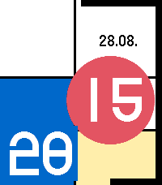
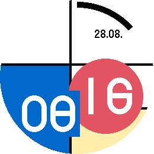
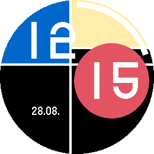

# Bauhaus

*The time as an abstract composition.*

    

A Pebble watchface (v1.0.0) that sets the time in the manner of three
Bauhaus-era artists:

- **Mondrian**: a grid of black rules and primary colour fields.
- **Albers**: nested squares in the spirit of *Homage to the Square*.
- **Moholy-Nagy**: diagonals and arcs.

The composition is regenerated every minute, every hour, once a day, or
never, while the time itself always moves.

## Settings

- Style: Mondrian, Albers or Moholy-Nagy
- New picture: every minute, hourly, daily or never
- Grid: off, thin or bold (Mondrian only)
- Palette: primaries, muted, mono or night
- Numerals: off (shapes only), small or large
- Minute rule: a line that travels once around the edge over the hour
- Transitions: the old number collapses and the new one grows back out
- Date
- Extra: steps or battery as a narrow bar along the bottom edge

## Platforms

- Pebble Time 2 (`emery`)
- Pebble Round 2 (`gabbro`)

## Building

With the [Pebble SDK](https://developer.repebble.com/sdk/):

```bash
pebble build
pebble install --emulator emery
```

The repository can also be imported into CloudPebble as is.
